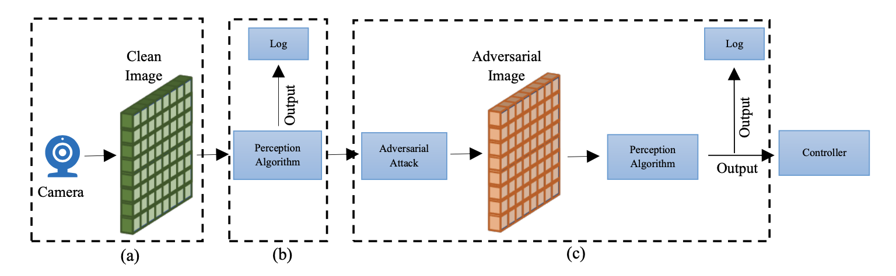
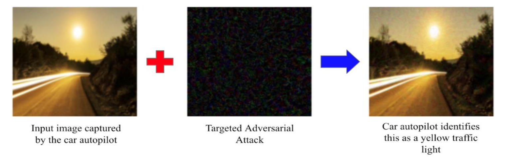
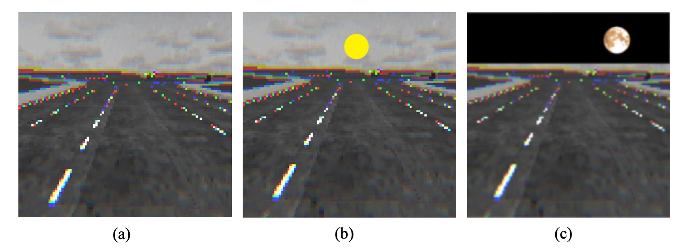
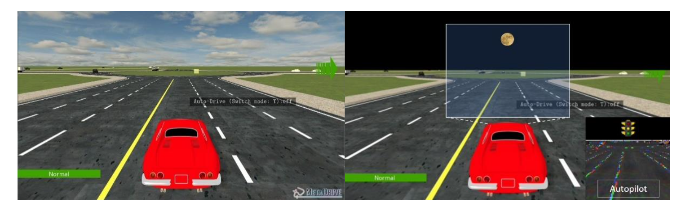
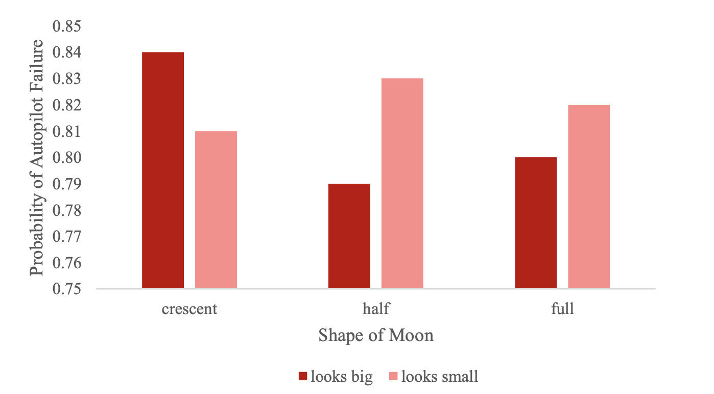
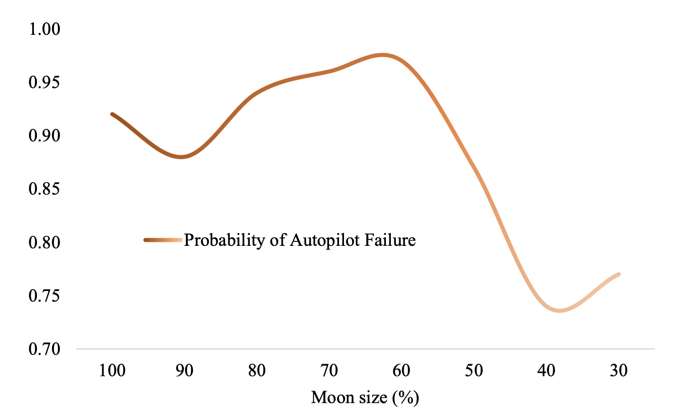
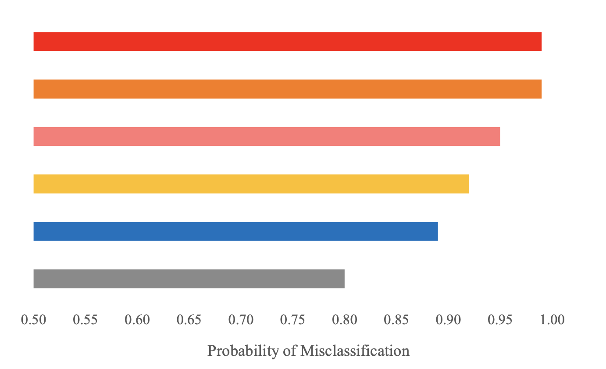
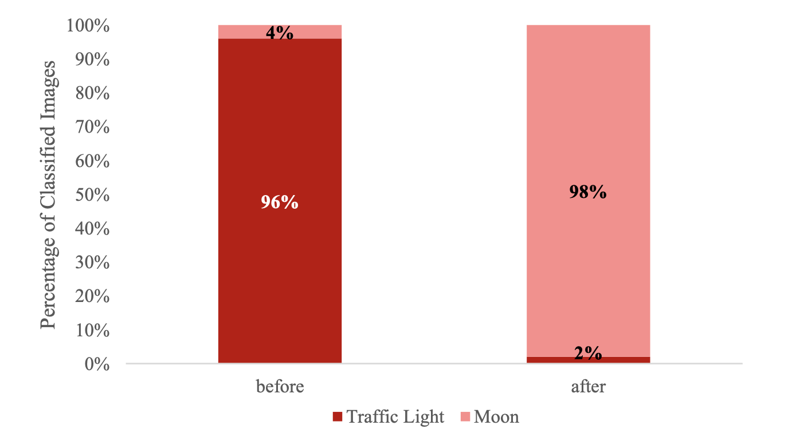
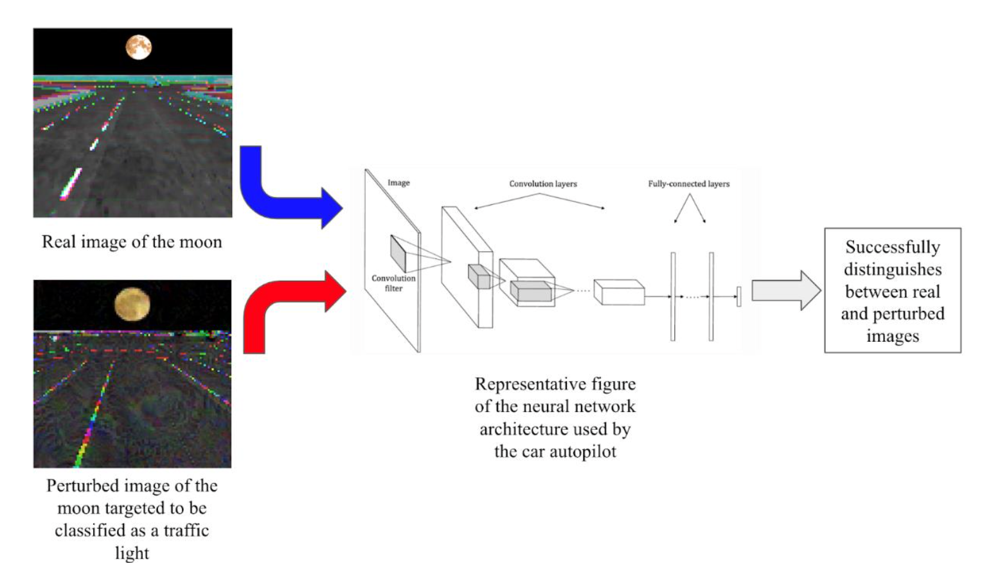

# Modeling and Study of Adversarial Attack Arising from Deceiving Perception in Car Autopilot

## [Report](https://drive.google.com/file/d/1oDLT-tGFP5JlN1V_EiNY9McwMdqJnAYp/view) | [Presentation Video](https://drive.google.com/file/d/1N5V5YexH3902M-3knspH_3AY7XIzYLH6/view?usp=sharing) | [Poster](https://drive.google.com/file/d/1oSgPL7so0WGtu6o-KZZhvHtjLGk7Jyvf/view)

This repository contains the code for the project done as a part of the course Trustworthy AI Autonomy at Carnegie Mellon University during Spring 2022 semester by Neel Joshi, Navodit Chandra and Aishwarya Ravi.

### Abstract
Safety of autonomous vehicles has been a matter concern lately. The autopilot system is heavily dependent on AI algorithms, from perception to control. Such systems are vulnerable to adversarial attacks arising from both random as well as intentional practices. This work models a real-life safety-critical scenario, where the moon is perceived as a traffic light, with the help of Digital Twin technology, such that car autopilots can be trained faster using these virtually generated scenarios. We create an end-to-end model starting from sensory perception to generating augmented scenarios based on original scenarios. We also show that majority of such safety-critical scenarios can be easily avoided. For this we demonstrate the efficacy of a real-time solution and a definitive solution.

### Scenario Generation

  Figure 1: Framework of adversarial scenario generation; (a) Sensor module, (b) Perception module, (c) Adversarial attack module
 

### Generation of Adversarial Images

Figure 2: Demonstration of images being perturbed by PGD adversarial attack algorithm

### Image Processing

Figure 3: Steps in processing of adversarial images (a) clean image from sensor (b) simplistic graphics (c) realistic graphics

### Digital Twin

Figure 4: Left - Scenario from MetaDrive simulator, Right - Same image modified for depicting how the perception algorithm for a real autopilot works

### Results and Analysis

Figure 5: Effect of lunar cycle on probability of autopilot failure. Big corresponds to size of moon when closest to earth and small corresponds to 50% of the full size.

Figure 6: Effect of size of moon as perceived from car sensor on autopilot failure

Figure 7: Effect of color of moon on autopilot failure

### Adversarial Defense

Figure 8: Randomized padding boosts adversarial defense in car autopilot

Figure 9: Adversarial training used to make the ResNet-18 neural network architecture robust to PGD attack
